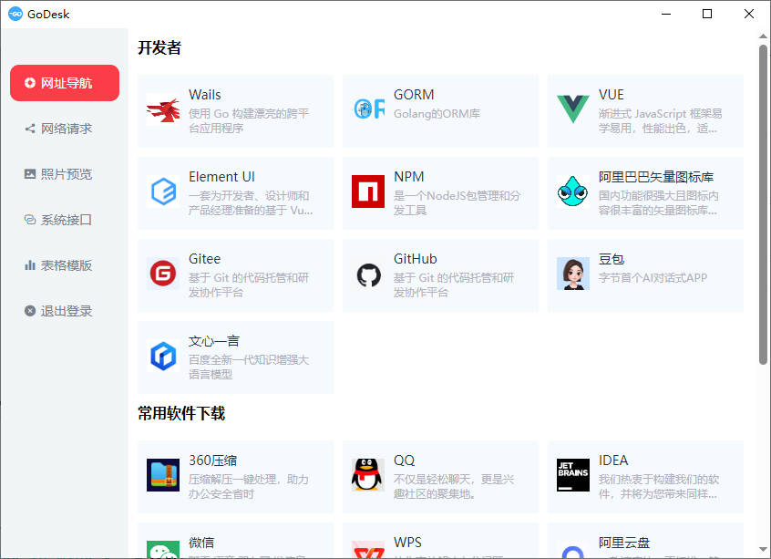

# GoDesk 介绍
>GoDesk 基于golang+wails+vue实现跨平台桌面应用程序开发模板，集成了vue路由、登录、element、windows DLL调用、Go代码调用

下载体验版：[https://gitee.com/xbuntu/go-desk/releases](https://gitee.com/xbuntu/go-desk/releases)

# 预览


# 开发环境搭建
- 安装 [go](https://studygolang.com/dl)  
- 配置 go 环境变量（参考）

```shell
#/opt/go 替换成 go 安装目录
export GOROOT=/opt/go
export GOPATH=/opt/go/path
export GOBIN=$GOPATH/bin
export GO111MODULE=on
export GOPROXY=https://goproxy.cn,direct
export GOPRIVATE=*.gitlab.com,*.gitee.com,*.github.com
export GOSUMDB=sum.golang.google.cn
export PATH=$PATH:$GOROOT/bin:$GOBIN
```

- 安装 gcc（推荐安装 [TDM-GCC](https://jmeubank.github.io/tdm-gcc/download/) ）  
- 安装 [wails](https://wails.io/zh-Hans/docs/gettingstarted/installation/)  
```shell
go install github.com/wailsapp/wails/v2/cmd/wails@latest
```
- 安装 [npm](https://nodejs.org/) 

# 运行命令
```shell
#如果首次打包提示 dist目录不存在，需先执行下面两条命令
cd frontend
npm i

#检测
wails doctor

#调试
wails dev

#打包 .exe
wails build 

#打包 .exe 带安装步骤
wails build -nsis -upx
```

# 参考网站
- [wails](https://wails.io/zh-Hans/docs/gettingstarted/installation/)  使用 Go 构建漂亮的跨平台应用程序    

- [npm](https://www.npmjs.com/)  Vue包检索网站

- [vue](https://cn.vuejs.org/)  用于构建用户界面的 JavaScript 框架   

- [Element UI](https://element.eleme.io/#/zh-CN/component/installation) 一套为开发者、设计师和产品经理准备的基于 Vue 2.0 的桌面端组件库    

- [upx](https://upx.github.io/)  用于压缩您的应用程序    

- [NSIS](https://nsis.sourceforge.io/Download)  用于生成 Windows 安装程序   

- [Gorm](https://gorm.io/zh_CN/docs/query.html)  go语言orm框架  

- [GoFrame](https://goframe.org/display/gf)  一款模块化、高性能、企业级的Go基础开发框架。    

- [Gin](https://gin-gonic.com/)  Go最快的全功能web框架  

- [golang中文网](https://studygolang.com/dl)  go学习交流平台  

- [TDM-GCC](https://jmeubank.github.io/tdm-gcc/download/)  windows系统 gcc 编译环境

# QQ交流群  

